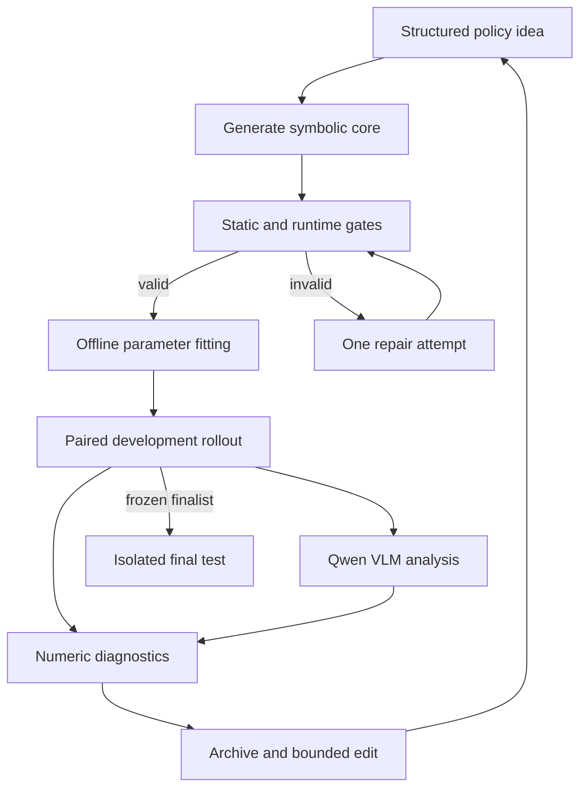

# Symbolic Policy Evolution Pipeline — Next-Phase Specification

**Status:** Draft for collaborative refinement  
**Version:** 0.4  
**Date:** 2026-09-08  
**Target task:** Meta-World `push-v2`  
**Primary artifact:** A fully symbolic deployed controller  
**Basis:** Existing pipeline refinement notes and the related-work review on symbolic policies, LLM-guided program evolution, imitation learning, diagnostic repair, and rigorous evaluation.

## 1. Purpose

This specification defines the next implementation and experimentation cycle for the symbolic-policy evolution pipeline. The immediate goal is to make candidate generation, numerical fitting, comparison, and repair trustworthy before increasing controller complexity or re-enabling reward-based reinforcement learning.

The research hypothesis is:

> Controlled diagnostic interventions can identify which symbolic component needs repair and thereby improve held-out task success per unit of search cost, when numerical fitting and evaluation budgets are held constant.

This is a hypothesis to test, not an established result or a novelty claim.

## 2. Goals

### 2.1 Primary goal

Build a reproducible search-and-repair pipeline that produces a compact symbolic policy with a statistically defensible improvement over the reproduced incumbent on final held-out `push-v2` cases.

### 2.2 Supporting goals

1. Make every candidate comparison paired, reproducible, and auditable.
2. Replace raw observation indices in generated policy bodies with validated named inputs.
3. Distinguish structural failure, parameter-fitting failure, distribution shift, and rollout noise.
4. Separate LLM structure search from numerical constant optimization.
5. Give the LLM structured evidence and require testable, bounded repair proposals.
6. Preserve symbolic deployment: no opaque neural layers in the final policy.
7. Report performance, reliability, complexity, and resource use together.

### 2.3 Provisional outcome targets

These targets are intentionally provisional and should be revised after the baseline-lock phase.

| Level | Target |
|---|---|
| Minimum credible improvement | Final-test success improves by at least 0.20 absolute over the reproduced incumbent, and the paired 95% confidence interval for the improvement excludes zero. |
| MVP | Final-test success is at least 0.50, subject to the statistical rule above. |
| Stretch | Final-test success is at least 0.80 without violating the symbolic-policy or matched-budget constraints. |
| Reliability | At least 95% of generated candidates compile and pass pre-rollout validation after at most one automated repair attempt. |

The previously reported honest re-evaluation of approximately 0.13 success is a planning reference only. It becomes the formal incumbent only if reproduced under the evaluation contract in this document.

## 3. Current State

The following values are reported by the existing project notes and have not yet been independently reproduced under the new evaluation contract.

| Checkpoint | Mean reward | Success rate | Interpretation |
|---|---:|---:|---|
| Original baseline | 16.60 | 0.00 | Observation and fitting bugs confound the result. |
| Correct action-space MSE | 37.42 | 0.00 | Necessary repair, but insufficient control. |
| Observation description added | 402.76 | 0.30 | Selected on a small, unmatched evaluation batch. |
| Saved winner re-evaluated | ~233 | ~0.13 | Best planning reference, still uncertain. |
| Scripted expert | 1068.34 | 1.00 | Upper reference under the reported setup. |

The immediate blocker is measurement validity: candidates have not consistently been evaluated on the same ordered tasks, resets, and policy-randomness seeds. As a result, score differences cannot yet be attributed confidently to policy changes.

### 3.1 Confirmed implementation facts

The following behavior has been confirmed in the current codebase:

| Area | Current behavior | Consequence |
|---|---|---|
| Policy output | `forward()` returns `(mean, std)`. `mean` is the pre-tanh Gaussian center; `std` is positive and is commonly a state-independent learned `log_std`, though state-dependent scale is allowed. | The interface is distribution-shaped even when the deployed action is deterministic. |
| Output validation | Generated policies are rejected before use if output shape, positive-`std`, or finite-value checks fail. | Basic distribution validity is already enforced, but semantic correctness is not. |
| Evolution evaluation | `evaluate_policy()` executes `action_space.high * tanh(mean)` and ignores `std`. Sampling is used only during RL data collection and non-deterministic GIF recording. | `std` does not affect the current evolution fitness score. Deterministic and sampled evaluation must remain separate. |
| Sampled policy execution | RL trajectory collection and sampled GIF recording draw `pretanh_action ~ Normal(mean, std)` and execute `tanh(pretanh_action)`. Policy samples are not action-clipped. | Any learned distribution objective for the current stochastic path must describe a tanh-squashed Gaussian. |
| Symbolic controller | Generated policies use explicit PyTorch math over selected observations, named scalar `nn.Parameter` values, sigmoid gates, and smooth blends. | The controller is a soft-gated closed-form program, not a sparse neural network. |
| Symbolic validation | `SymbolicPolicy.validate()` rejects listed neural modules such as Linear, Conv, recurrent, Transformer, and attention modules. | The current machine check is a module blacklist; it does not fully enforce an allowed set of symbolic operations. |
| BC optimizer | One Adam optimizer with learning rate `1e-3` fits every declared parameter in a single parameter group. There is no scheduler or per-parameter scaling. | Gains, metric thresholds, and sigmoid sharpness values receive the same optimizer settings despite different units and scales. |
| BC objective | The live loss is `MSE(tanh(mean), expert_action) + 0.01 * mean(std)`. The code docstring still incorrectly describes NLL. | The mean term matches deterministic evaluation; the linear scale term only pushes `std` downward and is not a likelihood. |
| Expert action target | The heuristic expert action is clipped to `[-1, 1]` during dataset collection and stored unscaled. Training applies no additional target clipping. | The mean target matches the normalized rollout action, but exact endpoint values may make inverse-tanh likelihoods undefined. |
| BC budget | The live evolution configuration runs exactly 2,000 gradient steps, with no early stopping or convergence check. Other code defaults are not used on the real path. | Every structure receives one fixed fitting attempt even if it converges early or needs more work. |
| Initialization | Each policy is instantiated once from LLM-written literals and trained in place. There is no perturbation or reinitialization. | A poor LLM initialization can cause a useful structure to be rejected. |
| Restarts | There is one BC run per candidate and no random restarts. | Candidate score confounds structure quality with one initialization and one optimizer trajectory. |
| Environment reset | One shared environment owns a persistent `_mt1_rng`; each reset advances it, and the inner environment is reset without an explicit seed. | Candidates receive different tasks and simulator states. Results depend on evaluation order. |
| RNG contamination | Dataset generation, trajectory collection, evaluation, and GIF recording consume the shared reset streams. | A candidate's cases depend on how much work earlier candidates performed, not even on a fixed offset. |
| Experiment tracking | Generated code and LLM prompts are currently preserved, but fitting, rollout, lineage, error, and resource records are not assembled into one complete candidate record. | The data appears accessible, but experiments cannot yet be reproduced or audited from saved artifacts alone. |

Known implementation locations include `lares/core/training_pipeline.py` for BC and evaluation, `lares/utils/metaworld_env.py` for task selection and reset behavior, `lares/core/policy_generation.py` for candidate construction, `lares/core/symbolic_policy.py` for symbolic validation, `lares/utils/policy_prompts/` for the generated-policy contract, and `tests/test_generate_policy.py` for output checks.

## 4. Scope

### 4.1 In scope

- Baseline reproduction and environment/version locking.
- Deterministic evaluation manifests and paired candidate comparisons.
- Trusted observation, action, batching, distribution, and parameter interfaces.
- Static and runtime validation of generated symbolic policies.
- Structured rollout diagnostics and per-episode records.
- Optional small-Qwen-VLM analysis of selected rollout failures.
- LLM-guided structural proposal and localized repair.
- Dedicated offline optimization of symbolic constants.
- Behaviorally diverse candidate archives.
- Optional learner-state imitation using scripted-expert labels.
- Experiments on bounded action-distribution objectives.
- Final held-out evaluation across independent search runs.

### 4.2 Out of scope for this cycle

- Re-enabling reward-based policy-gradient RL.
- Replacing the deployed symbolic controller with a neural policy.
- Optimizing constants directly on the final-test set.
- Claiming generality beyond `push-v2` before validation on additional tasks.
- Claiming equivalence to, or implementation of, the published LaRes method based only on the local directory name.

### 4.3 Constraints

- The deployed controller must be fully symbolic and inspectable.
- Generated policy code must not contain `nn.Linear` or other opaque neural layers.
- LLM use is allowed between episodes for proposing or repairing symbolic structure.
- Offline behavior cloning and numerical parameter optimization are allowed.
- Learner-state imitation is allowed only on training placements and must report expert-label and environment-interaction cost.
- Development feedback must never expose final-test cases to the search loop.
- The Qwen VLM is a training/development diagnostic tool, not part of the deployed symbolic controller.

## 5. Design Principles

1. **Measurement before search:** no optimization result is trusted until the evaluation contract is reproducible.
2. **Paired evidence:** candidates and incumbents receive the same ordered cases and randomness.
3. **Trusted shell, editable core:** infrastructure owns schemas, batching, distributions, bounds, and logging; generated code owns symbolic geometry, gates, and control expressions.
4. **Structure and constants are separate problems:** the LLM edits structure; a numerical optimizer tunes constants.
5. **Failures must be localized:** aggregate scores are supplemented by fitting, geometry, dynamics, and episode-level evidence.
6. **Every edit is a hypothesis:** a repair names its evidence, expected metric change, and protected behavior before evaluation.
7. **Final test is isolated:** repeated feedback converts any exposed set into development data.
8. **Budget is part of the result:** environment steps, expert queries, optimizer evaluations, LLM calls/tokens, wall time, and inference latency are reported.
9. **Visual analysis is supporting evidence:** Qwen VLM observations must point to frames or timestamps and must be checked against simulator metrics when possible.

## 6. Target Pipeline



The search loop may inspect training and development evidence. Only a frozen finalist and frozen evaluation procedure may access the final-test manifest.

## 7. Required Data Contracts

The exact serialization may change, but the semantics below are required.

### 7.1 `EvaluationManifest`

```yaml
manifest_id: string
environment:
  package: string
  version_or_commit: string
  env_id: push-v2
  reward_version: string
  wrappers: [string]
  horizon: integer
  action_scale: [number]
  success_rule: string
split: train | development | final_test
episodes:
  - case_id: string
    task_id: string
    reset_seed: integer
    policy_seed: integer
```

Requirements:

- Episode order is materialized and immutable.
- All compared policies receive the same manifest.
- Each episode explicitly selects its task and reset seed; evaluation must not depend on the current position of a hidden RNG stream.
- Environment, policy, and diagnostic state reset before every episode.
- Training, development, final-test, GIF, and debug work use separate environments and RNG streams.
- Deterministic and sampled-policy manifests/results remain distinct.

### 7.2 `PolicyIdea`

```yaml
idea_id: string
name: string
summary: string
named_observations: [tcp, object_pos, goal, previous_object_pos]
phases:
  - name: string
    activation: string
    action_intent: string
parameters:
  - name: string
    role: string
    type: structural | gain
    units: string
    initial_value: number
    range: [number, number]
zero_shot_behavior: string
expected_failure: string
protected_behaviors: [string]
```

Requirements:

- Raw observation indices are forbidden in the generated policy body.
- Every learnable parameter has a role, type, units, initializer, and range.
- All declared parameters are registered; no registered parameter is undeclared.
- Complexity is measured, not assumed. A 6–10 parameter family is the initial simple baseline, not a permanent hard cap.

### 7.3 `EvaluationReport`

```yaml
candidate_id: string
manifest_id: string
checkpoint: zero_shot | intermediate | fitted
validity:
  compile_ok: boolean
  shape_ok: boolean
  finite_ok: boolean
  batch_independence_ok: boolean
  range_coverage_ok: boolean
fitting:
  train_loss_by_axis: object
  validation_loss_by_axis: object
  loss_by_phase: object
  gradient_norms: object
  bound_activity: object
rollout:
  success_rate: number
  mean_return: number
  final_goal_distance: object
  signed_goal_progress: object
  lateral_drift: object
  min_tcp_object_distance: object
  object_displacement: object
  action_saturation_by_axis: object
  action_variation_by_axis: object
  phase_occupancy: object
  phase_transitions: object
  gate_statistics: object
  timeout_rate: number
visual_analysis_ids: [string]
episodes: [object]
unavailable_fields: [string]
```

Requirements:

- Missing measurements are marked unavailable, never silently recorded as zero.
- `near_object` is described as proximity unless the installed implementation verifies contact semantics.
- Generated policies may expose detached gate values through optional `self.last_gates: dict[str, Tensor]` telemetry.
- For each exposed gate, report mean, minimum, maximum, fraction of steps above `0.5`, first crossing of `0.5`, and transition count.
- Per-episode rows include case ID, success, return, final distance, progress, terminal stage, and failure label if available.

### 7.4 `VisualFailureAnalysis`

```yaml
analysis_id: string
candidate_id: string
case_id: string
model_id: string
prompt_version: string
media:
  - frame_or_clip_id: string
    start_timestep: integer
    end_timestep: integer
observed_stage: string
failure_summary: string
evidence:
  - statement: string
    frame_or_clip_id: string
    timestep: integer
candidate_hypotheses: [string]
uncertainties: [string]
recommended_numeric_checks: [string]
```

Requirements:

- Use a small Qwen VLM to analyze selected failed development rollouts.
- Select frames or clips using a fixed rule, such as episode start, closest approach, first major gate transition, maximum object movement, and termination.
- Every visual claim points to a frame, clip, or timestep.
- VLM output is supporting evidence. It cannot promote, reject, or repair a candidate without numerical or rollout validation.
- Record the Qwen model/version, quantization, prompt version, media-selection rule, latency, and compute cost.
- Never return final-test media or VLM analysis to the search loop.

### 7.5 `MutationProposal`

```yaml
proposal_id: string
parent_ids: [string]
mode: repair | simplification | crossover | exploration | parameter_only
observation: string
hypothesis: string
suspected_component: string
intervention: string
predicted_metric_change: string
protected_behaviors: [string]
focused_cases: [string]
```

Requirements:

- The proposal is rejected before code generation if its predicted effect is not measurable.
- A repair changes one bounded component unless an explicit exploration mode is selected.
- Parameter-only search normally bypasses the LLM and uses the numerical optimizer.

### 7.6 `ExperimentRecord`

```yaml
experiment_id: string
candidate_id: string
generation: integer
parent_ids: [string]
idea_id: string
status: generated | invalid | fitted | evaluated | promoted | rejected
code:
  source_path: string
  source_hash: string
llm:
  prompt_path: string
  response_path: string
  model_id: string
  decoding_config: object
validation:
  passed: boolean
  errors: [object]
fitting:
  optimizer_config: object
  data_split_id: string
  initial_parameters: object
  final_parameters: object
  best_parameters: object
  best_checkpoint: string
  loss_history_path: string
evaluation:
  manifest_ids: [string]
  report_ids: [string]
  intervention: boolean
resources:
  environment_steps: integer
  expert_queries: integer
  optimizer_evaluations: integer
  llm_calls: integer
  input_tokens: integer
  output_tokens: integer
  wall_time_seconds: number
timestamps: object
final_disposition: string
```

Requirements:

- Create a record for every attempted candidate, including invalid code and failed fitting runs.
- Preserve initial, final, and selected-best parameters rather than only the final object.
- Link every rollout result to the exact manifest, code hash, parameter checkpoint, and deterministic or sampled action mode.
- Save validation, compilation, runtime, and repair errors instead of dropping failed candidates.
- Keep expert-assisted intervention results clearly marked and ineligible for normal fitness ranking.
- Use stable candidate and experiment IDs to connect code, prompts, metrics, media, and lineage.
- A saved record must contain enough information to reconstruct and reevaluate the candidate without consulting terminal output.

## 8. Functional Requirements

### FR-1: Baseline lock and reproducibility

- Pin package versions/commits, environment ID, reward semantics, wrappers, horizon, action scaling, and success rule.
- Reproduce the scripted expert and saved incumbent on a shared manifest.
- Produce separate train, development, and final-test manifests.
- Replace the persistent shared `_mt1_rng` evaluation path with explicit task selection and per-episode simulator reset seeds from the manifest.
- Use separate environment instances and RNG streams for dataset generation, trajectory collection, development evaluation, final testing, GIF recording, and debugging.
- Preserve the final-test manifest from LLM prompts, diagnostic inspection, and optimizer decisions.

### FR-2: Trusted policy interface

- Centralize named observation accessors outside generated code.
- Centralize batching, action limits, policy reset, distribution construction, and parameter registration.
- Reject missing schemas, undeclared parameters, wrong shapes, non-finite values, cross-batch coupling, forbidden layers, and absent expected-input sensitivity before full rollout.
- Support optional detached `last_gates` telemetry without changing the controller action.
- Generated diagnostics must be detached from optimization state and safe to aggregate.

### FR-3: Structured evaluation

- Use success as the primary outcome.
- Use return, final goal distance, signed progress, and lateral drift as secondary outcomes.
- Record fitting, geometry, dynamics, gate/phase, saturation, and episode-level diagnostics.
- Optionally run the Qwen VLM on selected failed development episodes and attach its structured, evidence-linked analysis.
- Evaluate zero-shot, intermediate, and final fitted checkpoints using a predeclared checkpoint-selection rule.
- Keep deterministic and sampled-action evaluation separate.

### FR-4: Fair candidate selection

- All candidates in a comparison use the same ordered manifest and minimum tuning budget.
- Screening and promotion thresholds are declared before a generation runs.
- Candidate-versus-incumbent decisions use paired outcome differences.
- Selection never relies on non-overlap of two independently computed confidence intervals.
- Winner selection and final estimation use different data.

### FR-5: LLM feedback and edit control

- Supply full code for two informative parents, diagnostics for all candidates, recent errors, and compact experiment history.
- Support distinct edit modes: repair/exploitation, simplification, crossover, exploration, and parameter-only.
- Require every structural proposal to follow the `MutationProposal` contract.
- Compare per-idea and batched code generation; use the more reliable mode under a matched token/call budget.
- Include known code-generation hazards in the implementation prompt.

### FR-6: Numerical fitting

- Treat the current baseline as one Adam optimizer, one parameter group, learning rate `1e-3`, 2,000 steps, LLM initialization only, no scheduler, no convergence check, and no restarts.
- Keep controller structure fixed while comparing optimizers.
- Include current Adam, scaled/smooth Adam, equal-budget multistart, and an offline derivative-free optimizer such as CMA-ES or differential evolution.
- Match objective evaluations and report wall time for all optimizer comparisons.
- Inspect gradient norms, parameter-bound activity, and action-versus-parameter sensitivity.
- Split imitation data by complete trajectory or placement, not randomly by transition.

### FR-7: Bounded-action experiments

- Preserve the confirmed main fitness action as `action_space.high * tanh(mean)`; `std` is ignored in deterministic evaluation.
- Make the primary baseline `MSE(tanh(mean), expert_action)` with a fixed positive `std` supplied only to satisfy the `(mean, std)` interface.
- Remove `0.01 * std.mean()` and exclude `std` from optimization in the primary deterministic baseline; preserve the old objective only as a named legacy comparison if needed.
- Keep distribution learning out of the critical implementation path until measurement, diagnostics, and structure/parameter fitting are reliable.
- Measure exact endpoint frequency and inspect expert action-generation/clipping semantics before choosing a likelihood.
- For the existing sampled path, preserve the matching execution contract `tanh(Normal(mean, std).sample())`.
- Implement a mathematically correct tanh-Gaussian NLL for interior actions if the executed sampler is tanh-Gaussian:

  $$\operatorname{NLL}(a) = -\log \mathcal{N}(\operatorname{atanh}(a);\mu,\sigma) + \log(1-a^2).$$

- If expert clipping creates exact endpoint masses, a censored-Gaussian likelihood may be tested only as a later alternative with matching clipped-Gaussian execution; it is not the default for the existing tanh sampler.
- Do not call action-space Gaussian regression a likelihood unless execution uses the matching distribution.
- Refer to learned scale as residual scale unless an uncertainty method justifies a stronger interpretation.
- Correct the stale BC docstring so it describes the implemented objective.

### FR-8: Learner-state imitation

- Roll out learner policies only on training placements for data aggregation.
- Query the scripted expert on learner-visited states and verify that its response is a valid recovery action.
- Track all expert queries and environment interactions.
- Compare uniform and phase-balanced sampling under matched fitting budgets.
- Never add final-test trajectories to the imitation dataset.

### FR-9: Diagnostic intervention and repair

- Form competing hypotheses for observed failures, such as bad geometry, an inactive gate, insufficient gain, or an incorrect action dimension.
- Test a hypothesis with a controlled substitution on matched cases, such as replacing one phase/action dimension with the expert or forcing a gate.
- Accept a structural repair only if it changes the predicted focused metric and passes protected-case regression checks.
- Store observation → hypothesis → intervention → result, including rejected hypotheses.

### FR-10: Archive and traceability

- Maintain at least: the best robust policy, the simplest competitive policy, and one behaviorally distinct policy when available.
- Define diversity by rollout behavior or failure profile, not source-code text alone.
- Save source, code hash, parameters, manifests, prompts/responses, model IDs, splits, optimizer settings, loss history, metrics, errors, resource use, and lineage for every attempted candidate.
- Mark expert-assisted and gate-forced intervention runs so they can never enter ordinary fitness ranking.
- Preserve failed and rejected candidates as evidence, not only promoted policies.
- Generate the final summary directly from saved experiment records.

### FR-11: Qwen VLM-assisted failure analysis

- Add a small Qwen VLM as an optional error-analysis module for failed development rollouts.
- Give it only a compact, reproducibly selected set of frames or short clips plus basic episode metadata.
- Require output that follows the `VisualFailureAnalysis` contract.
- Merge VLM evidence with numerical diagnostics before constructing a repair prompt.
- Keep the original media, structured output, model/version, prompt, and runtime metadata for audit.
- If the VLM and simulator metrics disagree, mark the conflict instead of silently choosing one.
- Compare repair quality with and without VLM analysis under matched rollout and correction-LLM budgets.

## 9. Execution Process

### Phase 0 — Lock measurement and reproduce baselines

**Goal:** establish a trusted incumbent and evaluation procedure.

**Process:**

1. Pin the full environment/evaluation configuration.
2. Implement `EvaluationManifest`, explicit task selection, explicit simulator reset seeds, and policy-state reset.
3. Separate the environment instances and RNG streams used for data collection, development evaluation, final evaluation, GIF recording, and debugging.
4. Create non-overlapping training, development, and final-test manifests.
5. Re-evaluate the scripted expert, saved incumbent, and a deterministic smoke policy.
6. Repeat the same evaluations to verify exact reproducibility where deterministic.
7. Verify that running data collection or GIF recording cannot change later evaluation cases.

**Exit criteria:** AC-0 in Section 10.

### Phase 1 — Build the trusted interface and validator

**Goal:** prevent schema and code failures from reaching expensive rollouts.

**Process:**

1. Add named observation accessors and validate them against the installed environment.
2. Move invariant distribution, batching, bounds, and reset logic out of generated code.
3. Add static/runtime checks and precise error categories.
4. Add optional detached `last_gates` telemetry to the policy interface.
5. Aggregate gate mean, range, occupancy above `0.5`, first crossing, and transition count.

**Exit criteria:** AC-1.

### Phase 2 — Implement structured evaluation and reporting

**Goal:** make failures diagnosable and candidate comparisons statistically valid.

**Process:**

1. Implement `EvaluationReport` and per-episode logging.
2. Add paired candidate/incumbent comparisons.
3. Add initial 10-case screening and expanded 30-case contender evaluation as the first development-budget policy.
4. Record zero-shot, intermediate, and fitted checkpoints.
5. **TODO-QWEN-1:** integrate a small Qwen VLM that analyzes a fixed set of frames or short clips from failed development episodes and returns `VisualFailureAnalysis` records.
6. Store the visual evidence and combine it with numerical diagnostics without allowing the VLM to decide candidate acceptance.

The 10/30 budgets are starting values, not universal sample-size guarantees. They should be changed only through a documented protocol revision.

**Exit criteria:** AC-2.

### Phase 3 — Separate structure search from parameter fitting

**Goal:** avoid discarding good structures because one optimizer or initialization failed.

**Process:**

1. Freeze a representative bank of existing structures.
2. Reproduce the current one-run Adam configuration as the optimizer baseline.
3. Compare four numerical fitting methods under matched objective-evaluation budgets.
4. Measure sensitivity, bound activity, train/validation loss, and rollout performance.
5. Select a default optimizer and checkpoint rule using development data only.
6. Compare the initial simple 6–10 parameter family with a larger family as an ablation.

**Exit criteria:** AC-3.

### Phase 4 — Upgrade LLM proposal, feedback, and archive logic

**Goal:** turn evolution into evidence-driven, testable edits.

**Process:**

1. Implement `PolicyIdea`, `MutationProposal`, and `ExperimentRecord` validation.
2. Feed two full parents plus population-wide numerical diagnostics, optional Qwen VLM evidence, and recent errors.
3. Run per-idea versus batched code-generation A/B testing.
4. Add behavior-based archive retention.
5. Enforce one repair attempt for invalid generated programs.

**Exit criteria:** AC-4.

### Phase 5 — Test fitting and data-coverage improvements

**Goal:** determine whether remaining failures arise from the loss model or missing learner-state data.

**Process:**

1. Establish deterministic MSE with fixed positive `std` as the default baseline and remove the trainable linear `std` penalty from that baseline.
2. Audit exact action endpoints and expert action-generation semantics.
3. After earlier phases are stable, compare correct tanh-Gaussian NLL, residual-scale fitting, and censored Gaussian with matching execution where applicable.
4. Add a small DAgger-style learner-state aggregation loop on training placements.
5. Compare uniform and phase-balanced imitation minibatches.
6. Report deterministic and sampled-action outcomes separately.

**Exit criteria:** AC-5.

### Phase 6 — Add intervention-guided repair

**Goal:** test the central research hypothesis.

**Process:**

1. Select recurrent failure clusters from development diagnostics.
2. Form at least two competing explanations for each cluster.
3. Run controlled substitutions on matched cases.
4. Generate one bounded repair from the supported explanation.
5. Run focused validation, then protected-case regression validation.
6. Compare against evaluation-only and diagnostics-only search loops under matched budgets.

**Exit criteria:** AC-6.

### Phase 7 — Freeze and validate the final method

**Goal:** estimate generalization and total cost without further adaptation.

**Process:**

1. Freeze prompts, model/version identifiers, optimizer, budgets, archive rules, and selection logic.
2. Run five independent full searches from distinct search seeds.
3. Evaluate each frozen finalist on at least 100 final-test episodes, increasing the count only if the predeclared uncertainty target is not met.
4. Compare the full method with required ablations under matched resource budgets.
5. Generate a reproducible final report from saved artifacts.

**Exit criteria:** AC-7.

## 10. Acceptance Criteria

### AC-0: Measurement and baseline lock

- [ ] The environment package/commit, env ID, reward version, wrappers, horizon, action scale, success rule, and all seeds are recorded.
- [ ] Every compared candidate receives the identical ordered `EvaluationManifest`.
- [ ] A deterministic policy rerun on the same manifest produces identical per-episode actions/outcomes, or any unavoidable nondeterminism is measured and documented.
- [ ] Dataset generation, trajectory collection, GIF recording, and debug rollouts do not change any later evaluation case.
- [ ] Development and final evaluation do not share mutable environment or RNG state with other pipeline stages.
- [ ] Training, development, and final-test manifests are non-overlapping and have documented provenance.
- [ ] The expert and saved incumbent are reproduced; discrepancies from reported values are explained before proceeding.

### AC-1: Trusted interface

- [ ] Generated policy bodies contain no raw observation indices and use only validated named accessors.
- [ ] Missing schemas, wrong shapes, NaN/Inf values, parameter-range mismatches, batch coupling, and forbidden neural layers are rejected before full rollout.
- [ ] Every learnable parameter is declared, registered, initialized, bounded, and serialized.
- [ ] Policy state and diagnostic state reset independently for each episode.
- [ ] Optional `last_gates` telemetry is detached, batch-safe, reset per episode, and does not change returned `(mean, std)` values.
- [ ] Unit tests intentionally trigger every validator failure class.

### AC-2: Evaluation and diagnostics

- [ ] Every valid candidate produces an `EvaluationReport` and a per-episode table.
- [ ] Success is the primary metric; return and distance/progress metrics are secondary.
- [ ] Phase/gate occupancy and transition metrics appear when exposed; unavailable fields are explicit.
- [ ] Each exposed gate reports mean, minimum, maximum, occupancy above `0.5`, first crossing, and transition count.
- [ ] Candidate comparisons report paired success and return differences with uncertainty intervals.
- [ ] Zero-shot, intermediate, fitted, deterministic, and sampled results are not conflated.
- [ ] Qwen VLM outputs are schema-valid and every claimed visual event cites a frame, clip, or timestep.
- [ ] VLM evidence is never used alone to promote or reject a policy, and final-test media is never returned to the search loop.
- [ ] The Qwen VLM is enabled in the final search method only if E10 shows better repair quality or lower correction cost without worse held-out development success.

### AC-3: Numerical fitting

- [ ] At least four fitting configurations are compared on the same frozen structures and data.
- [ ] The current one-shot Adam path is reproduced exactly as a named baseline.
- [ ] Objective-evaluation budgets are matched; wall time and convergence are reported.
- [ ] Train/validation splits are by complete trajectory or placement.
- [ ] Gradient/sensitivity and bound-activity evidence is available for each structure.
- [ ] The default optimizer and checkpoint rule are chosen using predeclared development metrics.

### AC-4: LLM search loop

- [ ] Every proposal satisfies the structured idea and mutation schemas.
- [ ] Every non-exploratory edit states one primary hypothesis, one predicted measurable change, and protected behaviors.
- [ ] All population diagnostics and errors are retained; at least two informative parents can be compared.
- [ ] At least 95% of generated candidates reach rollout validation after no more than one repair attempt.
- [ ] The archive retains robust, simple, and behaviorally distinct candidates when available.
- [ ] Every attempted candidate has one schema-valid `ExperimentRecord`, including invalid and rejected candidates.
- [ ] Each evaluation can be traced to an exact code hash, parameter checkpoint, manifest, action mode, prompt/model configuration, and parent lineage.
- [ ] Expert-assisted intervention results are visibly labeled and cannot be selected as normal policy fitness.

### AC-5: Distribution and learner-state experiments

- [ ] The primary deterministic baseline uses only `MSE(tanh(mean), expert_action)` for policy fitting and returns a fixed positive `std` that is not optimized.
- [ ] The stale NLL docstring is corrected.
- [ ] Exact endpoint frequency and expert clipping semantics are measured before likelihood selection.
- [ ] Each distributional objective matches its executed sampling/clipping contract.
- [ ] Deterministic MSE remains as a matched baseline.
- [ ] Learner-state data uses training placements only, with expert-label and environment-step counts reported.
- [ ] Uniform versus phase-balanced sampling and fixed-buffer versus learner-state imitation are compared under matched fitting budgets.

### AC-6: Intervention-guided repair

- [ ] Each targeted failure cluster has at least two documented competing hypotheses.
- [ ] A controlled substitution isolates the suspected action dimension, phase, gate, or geometry term on matched cases.
- [ ] An accepted repair moves the predicted focused metric in the predicted direction.
- [ ] An accepted repair passes a predeclared protected-case regression threshold.
- [ ] The full repair loop outperforms evaluation-only, diagnostics-only, and optimizer-only ablations on held-out development cases at matched cost.

### AC-7: Final validation

- [ ] Prompts, models, code, optimizer, manifests, selection rules, and budgets are frozen before final testing.
- [ ] At least five independent search runs are completed.
- [ ] Each finalist is evaluated on at least 100 isolated final-test episodes.
- [ ] The paired 95% confidence interval for final success improvement over the reproduced incumbent excludes zero.
- [ ] Final success meets the minimum credible-improvement target; MVP and stretch targets are reported separately.
- [ ] The final report includes success, return, final distance, invalid-program rate, repair acceptance rate, complexity, deterministic/sampled performance, simulator steps, expert labels, numerical evaluations, LLM calls/tokens, wall time, and inference latency.
- [ ] One documented command regenerates the aggregate report from saved experiment artifacts.

## 11. Experiment Matrix

The following comparisons are required before claiming that the full pipeline causes the improvement.

| ID | Comparison | Controlled variables | Primary question |
|---|---|---|---|
| E1 | Unpaired legacy evaluation vs paired manifest | Same policies and episode count | How much ranking noise came from unmatched cases? |
| E2 | Current Adam vs scaled Adam vs multistart vs derivative-free fitting | Structures, BC data, objective evaluations | Are structures being rejected because constants were poorly tuned? |
| E3 | 6–10 parameter family vs larger family | Search/tuning budget | Does added complexity improve held-out success enough to justify it? |
| E4 | Batched vs per-idea code generation | Ideas, model, calls/tokens | Which mode yields higher valid-code and faithful-implementation rates? |
| E5 | Two scalar feedback vs structured diagnostics | Search budget and generator | Do diagnostics improve successful repairs and search efficiency? |
| E6 | No intervention vs controlled diagnostic intervention | Diagnostics and search budget | Does intervention localize the correct repair? |
| E7 | Fixed-`std` deterministic MSE vs later tanh NLL, residual scale, and matching censored-Gaussian alternative | Structures, data, tuning budget | Does learning a distribution add value beyond the simple deterministic controller? |
| E8 | Fixed-buffer BC vs learner-state imitation | Expert labels and environment interactions reported | Does distribution-shift correction improve recovery and success? |
| E9 | Full method vs evaluation-only vs diagnostics-only vs optimizer-only | Total LLM, simulator, expert, and fitting budget | Which components are causally responsible for gains? |
| E10 | Numeric diagnostics only vs numeric diagnostics plus small Qwen VLM | Failed episodes, correction-LLM model, prompts, and search budget | Does visual analysis improve repair quality or reduce correction cost? |

## 12. Statistical and Promotion Rules

1. A candidate first runs on the fixed 10-case development screening subset.
2. A contender must satisfy validity gates and a predeclared screening rule before receiving the 30-case expanded evaluation.
3. Candidate and incumbent are compared using paired episode outcomes on the same cases.
4. Promotion is based primarily on success difference; return and distance may break a tie only under a predeclared rule.
5. Estimate uncertainty for the paired difference itself. Do not infer significance from overlap or non-overlap of separate confidence intervals.
6. Cluster or resample complete task/episode units when repeated trials share a task placement.
7. Final method comparisons include variability across independent search runs, not only episodes within one selected run.
8. Report all candidates used in selection to make winner's-curse and selection effects visible.
9. If the final interval is too wide for the intended claim, increase final-test episodes according to a predeclared sequential rule; do not alter the policy.

## 13. Deliverables

- Version-locked environment and evaluation configuration.
- Train, development, and isolated final-test manifests.
- Trusted symbolic-policy wrapper and validator test suite.
- Structured policy-idea, mutation, experiment, and evaluation schemas.
- Complete per-candidate experiment records covering generation, validation, fitting, evaluation, errors, lineage, and resource use.
- Per-candidate and aggregate evaluation reports.
- Small-Qwen-VLM failure-analysis module, prompt, media-selection rule, and structured outputs.
- Numerical-optimizer benchmark report.
- Action-distribution and learner-state-imitation ablation results.
- Intervention-guided repair implementation and ablation results.
- Frozen finalist policies with code, constants, lineage, and complexity measures.
- Final reproducibility package and one-command report generation.

## 14. Risks and Mitigations

| Risk | Mitigation |
|---|---|
| Small development batches select lucky policies | Paired manifests, staged promotion, fresh confirmation cases, and isolated final testing. |
| LLM rewrites too much to attribute gains | Bounded repair mode, explicit hypothesis, focused validation, and protected regression cases. |
| A promising structure is rejected after poor fitting | Matched multistart/derivative-free fitting and checkpoint tracking before structural rejection. |
| Generated code exploits or breaks the wrapper | Immutable trusted shell, operator/layer restrictions, static/runtime tests, and resource limits. |
| Diagnostics are mistaken for ground truth | Validate local semantics, label proximity/contact correctly, and mark unavailable data explicitly. |
| Qwen VLM hallucinates an event or misreads depth/contact | Require frame/timestep evidence, cross-check simulator metrics, record disagreements, and keep VLM output advisory. |
| Qwen VLM adds cost without improving repairs | Use compact media selection, report latency/compute, and keep the module only if the matched-budget ablation shows value. |
| DAgger consumes excessive expert/environment budget | Small gated rounds, novelty/phase-aware sampling, and explicit budget accounting. |
| Development set becomes overfit through repeated LLM feedback | Rotate only within a predeclared development protocol and preserve a never-exposed final test. |
| Distribution objective and execution sampler disagree | Define and test one probability contract end to end. |
| Complexity grows without evidence | Keep a simple competitive archive member and require measured justification for new phases/terms. |

## 15. Open Decisions for the Next Refinement

1. What exact environment/package version and local observation layout should be canonical?
2. What development-case counts and promotion margins fit the available compute budget?
3. What is the protected-case regression tolerance for accepting a repair?
4. Which derivative-free optimizer is easiest to integrate first: CMA-ES or differential evolution?
5. Should the first archive retain three candidates or a larger Pareto set?
6. Is the scripted expert reliable on learner-visited recovery states?
7. What fixed positive `std` value should the deterministic baseline return to satisfy the current interface?
8. What action endpoint frequency and clipping semantics are present in the actual expert buffer?
9. Which additional manipulation task should be used only after `push-v2` acceptance criteria are met?
10. What exact LLM model/version, token budget, and repair-call budget should be frozen for ablations?
11. Which small Qwen VLM model, quantization, and runtime should be used?
12. Should the Qwen VLM receive individual keyframes, short clips, or both?
13. What fixed media-selection rule gives enough visual evidence at acceptable cost?

## 16. Related Research Informing This Plan

- [Deep Symbolic Policy (2021)](https://proceedings.mlr.press/v139/landajuela21a.html): fully symbolic continuous-control deployment and the importance of closed-loop evaluation.
- [DAgger (2011)](https://proceedings.mlr.press/v15/ross11a.html): learner-state data aggregation to reduce imitation-learning distribution shift.
- [Code as Policies (2022)](https://arxiv.org/abs/2209.07753): executable policies built around explicit perception and control interfaces.
- [ReEvo (2024)](https://arxiv.org/abs/2402.01145): comparative reflection and evolutionary LLM search.
- [AlphaEvolve (2025)](https://arxiv.org/abs/2506.13131): evaluator-driven evolution, archives, and staged evaluation.
- [TIDE (2026)](https://arxiv.org/abs/2601.21239): separation of structural proposal and numerical parameter tuning.
- [Act-Observe-Rewrite (2026)](https://arxiv.org/abs/2603.04466): diagnostic controller rewriting between episodes.
- [Kintsugi (2026)](https://arxiv.org/html/2605.09487v1): localized edits, deterministic checks, focused validation, and regression protection.
- [Soft Actor-Critic, Appendix C (2018)](https://arxiv.org/pdf/1801.01290): change-of-variables treatment for tanh-squashed Gaussian policies.
- [Clipped Action Policy Gradient (2018)](https://proceedings.mlr.press/v80/fujita18a/fujita18a.pdf): probability treatment for clipped action distributions.

## 17. Change Log

| Version | Date | Change |
|---|---|---|
| 0.4 | 2026-09-08 | Made complete experiment tracking mandatory for every attempted candidate, including reproducible code/parameter/manifests, errors, lineage, resource use, and intervention labels. |
| 0.3 | 2026-09-08 | Made fixed-`std` deterministic MSE the primary baseline, recorded tanh-Gaussian sampling and expert target clipping, deferred distribution learning to ablations, and added the stale-docstring fix. |
| 0.2 | 2026-09-08 | Added confirmed policy, fitting, and evaluation behavior; explicit RNG isolation; `last_gates` telemetry; and the small-Qwen-VLM failure-analysis TODO and ablation. |
| 0.1 | 2026-09-07 | Initial next-phase specification based on the pipeline notes and related-work review. |
